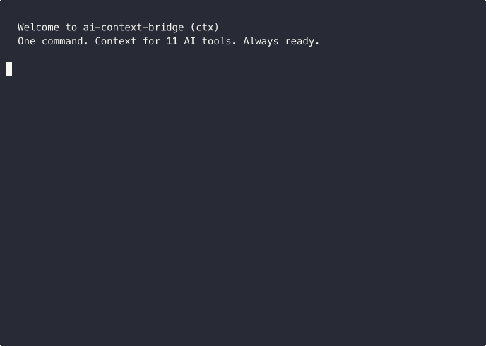

<p align="center">
  <h1 align="center">ai-context-bridge</h1>
  <p align="center">
    <strong>Switch between AI coding tools without losing context.</strong><br>
    Autonomous, always-ready context that survives rate limits.
  </p>
  <p align="center">
    <a href="https://www.npmjs.com/package/ai-context-bridge"></a>
    <a href="https://www.npmjs.com/package/ai-context-bridge"></a>
    <a href="https://github.com/himanshuskukla/ai-context-bridge/actions"></a>
    <a href="https://github.com/himanshuskukla/ai-context-bridge/blob/main/LICENSE"></a>
    
  </p>
</p>

```bash
npm i -g ai-context-bridge
```

<p align="center">
  
</p>

## The Problem

You're deep in a coding session with Claude Code. **Rate limit hits.** You can't even run a save command — the session is dead. Switch to Cursor? You'd have to re-explain everything from scratch.

Working on multiple projects side by side? Every tool has its own config format. Context doesn't transfer.

**76% of developers now use 2+ AI coding tools** (Stack Overflow 2025). Every switch between them means lost context.

## The Solution

```bash
ctx init              # Private repos: stores context in .ctx/ inside the project
ctx init --external   # Public repos: stores context in ~/.ctx-global/ (zero files in repo)
```

**That's it.** From now on, your context is **always ready**:

- Git hooks auto-save on every commit, checkout, and merge
- Resume prompts for all 11 tools sit ready (`.ctx/resume-prompts/` or `~/.ctx-global/projects/<name>/resume-prompts/`)
- When a rate limit hits, just open the file and paste into your next tool

For manual switching:
```bash
ctx switch cursor    # Saves session + generates Cursor config + copies resume prompt
```

## How It Stays Autonomous

| Trigger | What Happens | You Do Nothing |
|---------|-------------|----------------|
| `git commit` | Auto-saves context, refreshes all resume prompts | Yes |
| `git checkout` | Updates branch context, refreshes prompts | Yes |
| `git merge` | Updates context with merge state | Yes |
| `ctx watch` | Background watcher refreshes every 30s + on file changes | Yes |
| Rate limit hits | Resume prompts already in `.ctx/resume-prompts/` | Just open & paste |

### The Rate Limit Scenario (Solved)

**Before ctx**: Rate limit hits → session dead → open Cursor → re-explain everything → **15 min wasted**

**With ctx**: Rate limit hits → open `.ctx/resume-prompts/cursor.md` → paste into Cursor → **keep working in 10 seconds**

## Supported Tools (11)

| Tool | Config Format | Size Limit |
|------|--------------|------------|
| **Claude Code** | `CLAUDE.md` | ~100K chars |
| **Cursor** | `.cursor/rules/*.mdc` | ~2.5K/file |
| **OpenAI Codex** | `AGENTS.md` | 32 KiB |
| **GitHub Copilot** | `.github/copilot-instructions.md` | No limit |
| **Windsurf** | `.windsurf/rules/*.md` | 6K/file, 12K total |
| **Cline** | `.clinerules/*.md` | No limit |
| **Aider** | `CONVENTIONS.md` + `.aider.conf.yml` | No limit |
| **Continue** | `.continue/rules/*.md` | No limit |
| **Amazon Q** | `.amazonq/rules/*.md` | No limit |
| **Zed** | `.rules` | No limit |
| **Antigravity (Google)** | `AGENTS.md` + `.antigravity/*.md` | No limit |

## Quick Start

```bash
# 1. Install globally
npm i -g ai-context-bridge

# 2. Initialize in your project (auto-installs hooks, pre-generates everything)
cd my-project
ctx init                # Private repo: .ctx/ inside the project
# OR
ctx init --external     # Public repo: zero files in the project, data in ~/.ctx-global/

# 3. Work normally. Context auto-saves on every commit.

# 4. When rate limit hits, your resume prompts are already ready:
#    .ctx/resume-prompts/cursor.md  (or ~/.ctx-global/projects/<name>/resume-prompts/)
#    .ctx/resume-prompts/codex.md
#    .ctx/resume-prompts/claude.md
#    ...

# 5. Or manually switch:
ctx switch cursor
```

<details>
<summary><strong>See it in action</strong></summary>

### ctx init


### ctx switch


</details>

## External Storage (Public Repos)

Working on a public or open-source repo? Use `--external` to keep zero ctx files in the project:

```bash
cd ~/my-open-source-project
ctx init --external
```

All ctx data (config, rules, sessions, resume prompts) is stored at `~/.ctx-global/projects/<project-name>/` instead of `.ctx/` inside the project. Git hooks still work — they live in `.git/hooks/` which git never pushes.

This prevents accidentally pushing session data with `git add .`. All commands (`ctx status`, `ctx switch`, `ctx save`, etc.) work identically — the path resolution is automatic.

## Multi-Project Support

Working on multiple projects? `ctx` tracks them all:

```bash
# Each project gets its own context (auto-registered on init)
cd ~/project-a && ctx init
cd ~/project-b && ctx init --external   # mix and match modes

# See all your projects in one place
ctx projects list
```

Output:
```
Projects (2)
  project-a [feature/auth] (live)
    ~/project-a (git) — Implementing JWT auth
    Last active: 5m ago

  project-b [main] (live)
    ~/project-b (git) — Building dashboard
    Last active: 2h ago

  2 project(s) with live context ready.
```

## Commands

| Command | Description |
|---------|-------------|
| `ctx init [--external]` | Initialize + hooks + global registry + pre-generate |
| `ctx save [message]` | Manual session snapshot |
| `ctx resume --tool <name>` | Generate config + resume prompt for target tool |
| `ctx switch <tool> [msg]` | Save + resume in one step |
| `ctx sync` | Generate configs for all enabled tools |
| `ctx status` | Full status with autonomous feature info |
| `ctx watch` | Background watcher (continuous auto-save) |
| `ctx hooks install\|uninstall\|status` | Manage git hooks |
| `ctx projects list\|remove` | Multi-project dashboard |
| `ctx session list\|show\|delete` | Manage sessions |
| `ctx rules add\|list\|delete\|validate` | Manage rules |
| `ctx tools list\|check` | Show/detect supported tools |

### Flags

- `--external` — Store ctx data outside the project (for public repos)
- `--dry-run` — Preview changes without writing
- `--verbose` — Detailed output
- `--quiet` / `-q` — Minimal output
- `--no-clipboard` — Don't copy resume prompt
- `--no-hooks` — Skip git hook installation on init

## How It Works

### The `.ctx/` Directory

```
.ctx/
  config.json              # Tool preferences, enabled tools
  rules/                   # Universal rules (git-tracked, shared)
    01-project.md
    02-code-style.md
  sessions/                # Session snapshots (gitignored)
    live.json              # Always-current live session
    main/
      sess_2026-02-19T10-30-00_001.json
  resume-prompts/          # Pre-generated, always ready (gitignored)
    claude.md
    cursor.md
    codex.md
    ...
```

- **Rules** → git-tracked, shared with team (internal mode)
- **Sessions + resume prompts** → gitignored, personal/ephemeral
- **External mode** (`--external`) → same structure at `~/.ctx-global/projects/<name>/`, zero files in project
- **No git?** Works fine as local directory mode — just no auto-hooks

### Storage Options

| Mode | How | Auto-Save |
|------|-----|-----------|
| **Git** (default) | Git hooks + watcher, `.ctx/` in project | On commit/checkout/merge |
| **External** (`--external`) | Git hooks + watcher, data in `~/.ctx-global/` | On commit/checkout/merge |
| **Local** | No git, just `.ctx/` dir | `ctx watch` or manual `ctx save` |

Use **External** for public/open-source repos where you want zero ctx files in the project directory.

### Token-Aware Compilation

Each tool has different size limits. `ctx` compiles your rules + session to fit:

- Session context has priority (never truncated)
- Rules added in priority order until budget exhausted
- Windsurf gets aggressive compression (6K/file, 12K total)

## Zero Dependencies

Zero production dependencies. Only Node.js built-ins:
- `node:util`, `node:fs`, `node:readline`, `node:child_process`, `node:os`

Fast startup. No native compilation. No bloat.

## Why Not Just Use Ruler?

[Ruler](https://github.com/intellectronica/ruler) (~2,500 stars) is excellent for syncing rules and coding conventions across AI tools. If that's your main need, use it — it does that job well.

`ctx` solves a **different problem**: what happens when your AI session dies mid-work and you need to resume in another tool in 10 seconds.

| What you need | Ruler | ctx |
|---------------|-------|-----|
| Sync rules across tools | **Yes — Ruler's strength** | Yes |
| Save session context (branch, work-in-progress, decisions) | No | **Yes** |
| Survive rate limits (pre-saved, no command needed) | No | **Yes** |
| Autonomous (git hooks, zero workflow change) | No | **Yes** |
| External storage (zero files in public repos) | No | **Yes** |
| Multi-project dashboard | No | **Yes** |
| Zero dependencies | Yes | Yes |
| Tools supported | 11 | 11 |

**Use Ruler** to keep your tools configured the same way. **Use ctx** to keep your work-in-progress transferable between tools. They complement each other.

## Comparison

Different tools solve different parts of the AI context problem:

| What it does | ctx | Ruler | ai-rulez | ContextPilot | SaveContext |
|--------------|-----|-------|----------|-------------|------------|
| Rules sync | Yes | **Yes** | **Yes** | Yes | No |
| Session context | **Yes** | No | No | Basic | Yes |
| Survives rate limits (pre-saved) | **Yes** | No | No | No | No |
| Autonomous (git hooks) | **Yes** | No | No | No | No |
| External storage (public repos) | **Yes** | No | No | No | No |
| Multi-project dashboard | **Yes** | No | No | No | No |
| Zero dependencies | Yes | Yes | No | No | No |
| Tools supported | 11 | 11 | **18** | 5 | 4 |

**Where others are stronger:** ai-rulez supports more tools (18 vs 11). Ruler has a larger community (~2,500 stars) and battle-tested rule syncing. ContextPilot integrates with VS Code natively.

**Where ctx is different:** Autonomous session saving via git hooks, rate-limit survival, and external storage for public repos. These are problems the other tools weren't designed to solve.

## Development

```bash
git clone https://github.com/himanshuskukla/ai-context-bridge
cd ai-context-bridge
npm install
npm run build
npm test          # 115 tests
```

## Contributing

See [CONTRIBUTING.md](CONTRIBUTING.md) for development guide and adapter development instructions.

## License

MIT
